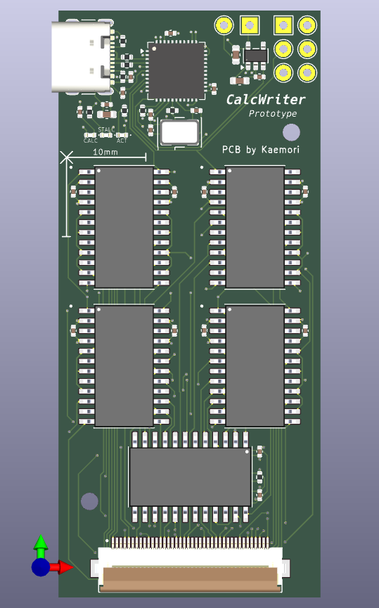
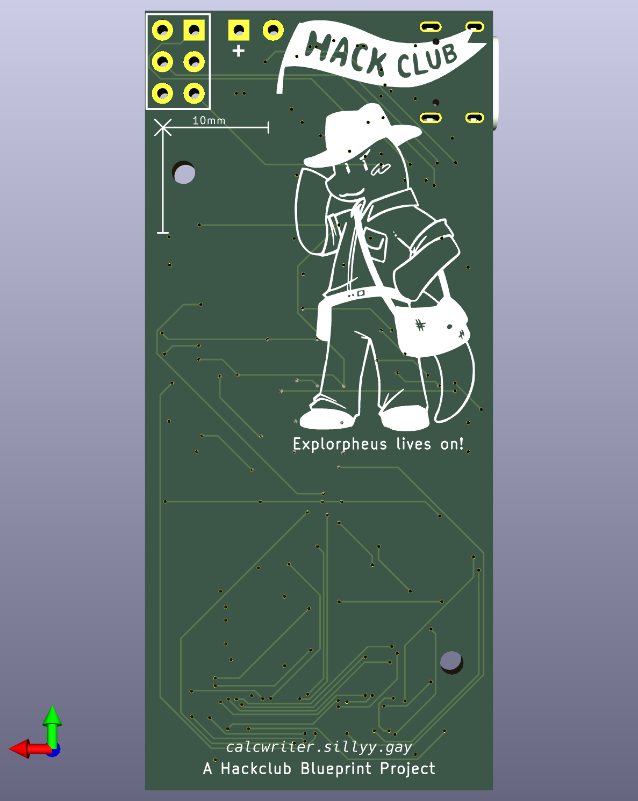
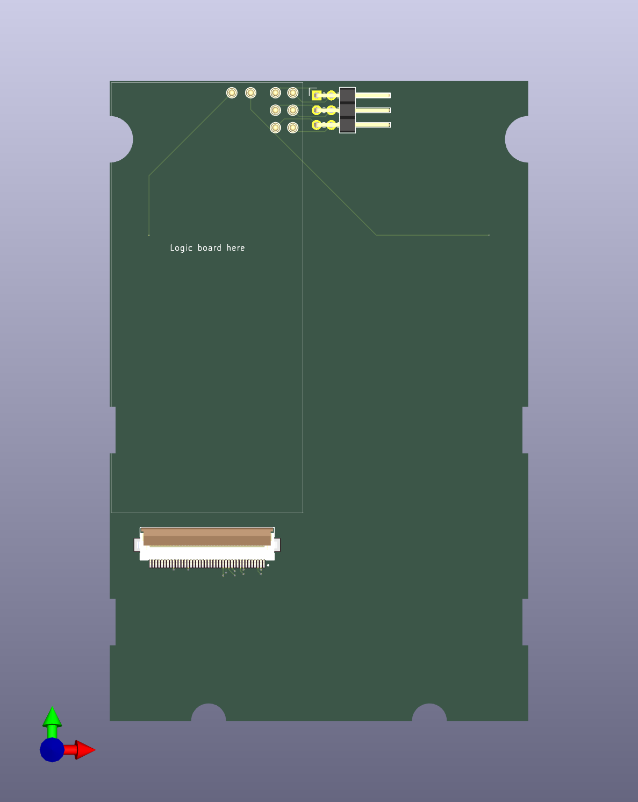
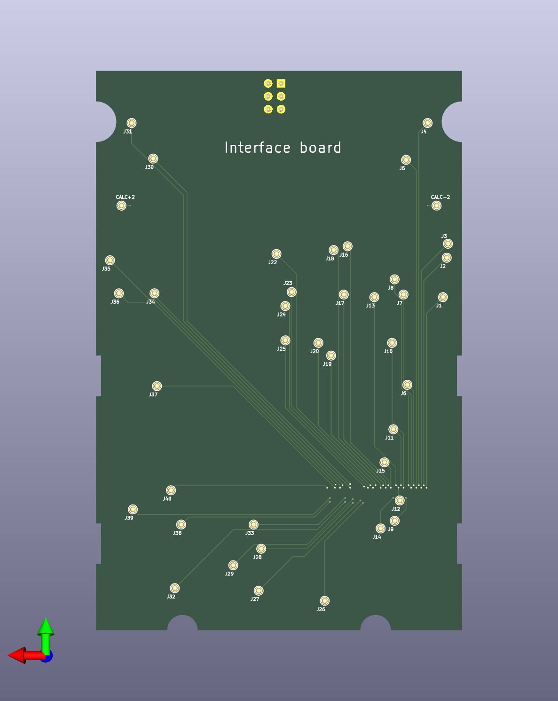
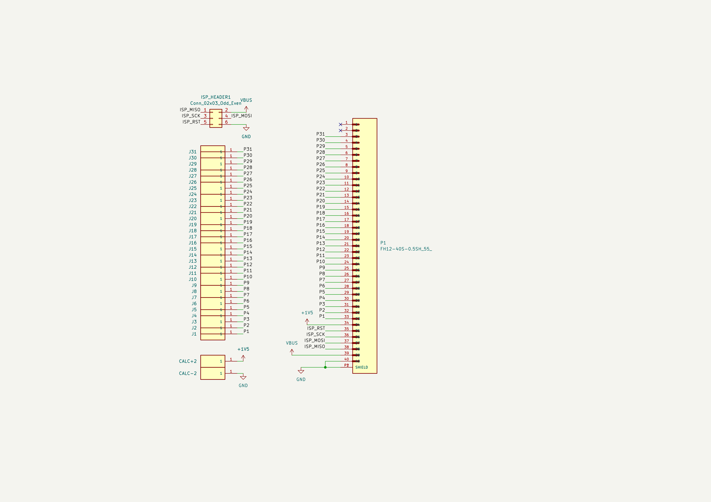

A hardware board that emulates keypresses on the keypad matrix of a Sharp EL-W531S II calculator.

## but... why tho?

So uh, once upon a bus ride home, I had a brain blast — a year before, I made math equations that mimicked computer logic ops like `AND`, `OR`, `NOT`, etc. Then I got spicy and added stuff like `SIGN`, `TO_BOOL`, and `EQUALS_TO`. I even hacked together `if` statements and pseudo-loops! but... I couldn’t store variables (tragic).

Eventually I realized I could abuse rounding errors and tangent’s cycly-ness to make storage actually _work_. Huge win. But typing those monster equations by hand? Pain. so the project died (rip scrap paper notes).

Then I wondered if a calculator could be turing complete (spoiler: no 💀), which spiraled into "what if I made it _automate itself_"? Thus, **Calcwriter** was born.

This project was mostly self-sponsored... until I found out that hackclub had blueprint ysws. Then I was like "wait why pay for chaos when I can get _sponsored_ for chaos?"

# Project Overview:

This board is split into two parts, mainly for modularity and also to cut costs for prototyping:

## 1. The logic board:

| Front                                                         | Back                                                         | Schematics                                                         |
| ------------------------------------------------------------- | ------------------------------------------------------------ | ------------------------------------------------------------------ |
|  |  |  |

The logic board is the main component, where all the calculations and inputs are actually happening. It is powered by an ATmega32U4 microcontroller and a bunch of SPST Analog Switches (MAX335CWGs) for controlling inputs. Equations will be sent over by the main device through a serial connection, which also powers the board.

## 2. The Interface board:

| Front                                                        | Back                                                        | Schematics                                                        |
| ------------------------------------------------------------ | ----------------------------------------------------------- | ----------------------------------------------------------------- |
|  |  |  |

The interface board is the board that connects the logic board to the calculator. It has 31 input pogo pins, as well as 2 power supply pins, each precisely placed such that when the board is placed onto the calculator, the pogo pins connects to the matrix vias of the calculator. The connections are then extended up through a ribbon cable into the logic board for the actual controlling part. The interface board provides power to the calculator, and also provides an ISP interface to program the ATmega32U4. This part is seperated as it allows my logic board to stay as small as possible, and also to make it so that I dont have to waste a lot of money on 4 layers of mostly just empty boards and pogo pins.

# Bill Of Material:

later

TODO: remember to write basic firmware for the board. remember to print out both boards for scale. remember to make a case for the calculator, and the board.
